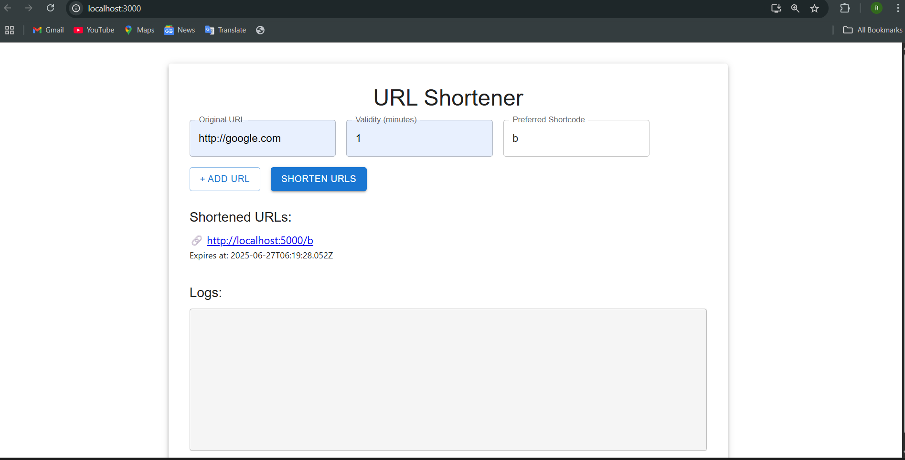

📘 README.md – Frontend (URL Shortener)
This is the frontend for the URL Shortener application built using React and Material UI.

🚀 Features
Input multiple URLs (up to 5 at a time)

 

Option to:

Set validity (in minutes)

Use a custom shortcode

Displays:

Shortened URLs

Expiry time

Log messages for every action

📁 Folder Structure
csharp
Copy
Edit
frontend/
├── public/
├── src/
│   ├── App.js         # Main React component
│   ├── index.js       # Entry point
│   └── logger.js      # Handles logging logic
├── package.json
└── README.md
🛠️ Requirements
Node.js & npm

Internet connection (if using external logging services)

📦 Install Dependencies
bash
Copy
Edit
npm install
💻 Start the Frontend App
bash
Copy
Edit
npm start
This will run the app on http://localhost:3000
